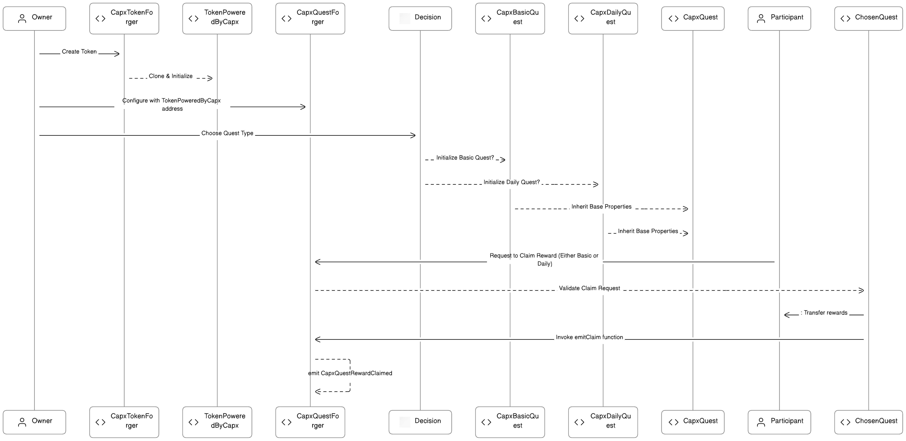

## Overview:

1. **CapxTokenForger**: This contract is responsible for creating new tokens powered by Capx. It acts as a factory for creating new token contracts.
2. **CapxQuest**: This is a base contract that represents a quest in the ecosystem. It has the basic functionalities and properties that all quests will have.
3. **CapxBasicQuest**: This contract inherits from `CapxQuest` and represents a basic quest type. Participants can claim rewards based on the conditions set in the quest.
4. **CapxDailyQuest**: This contract also inherits from `CapxQuest` and represents a daily quest type. It has a similar structure to `CapxBasicQuest` but with some differences in the claim mechanism.
5. **CapxQuestForger**: This contract is designed to forge or create quests within the Capx ecosystem. It provides functionalities to create different types of quests, manage quest parameters, and handle quest-related operations.

## Comprehensive Flow:

1. **Token Creation and Management**:
   - **CapxTokenForger**:
     - The owner interacts with the `CapxTokenForger` contract to create new tokens.
     - The `createTokenPoweredByCapx` function is invoked, which clones the `TokenPoweredByCapx` contract and initializes it with parameters like name, symbol, owner, etc.
     - These tokens are representations and can be used as rewards in quests.
     - The `CapxTokenForger` maintains a mapping of all tokens powered by Capx.

   - **TokenPoweredByCapx**:
     - This contract acts as a blueprint for tokens. It's not a standard ERC20 but a representation of tokens that can be used within the system.

2. **Quest Forger Configuration and Validation**:
   - **CapxQuestForger**:
     - The owner initializes the `CapxQuestForger` with the address of the `TokenPoweredByCapx`.
     - The `CapxQuestForger` is responsible for validating claims from quests.
     - It contains the logic to verify signatures and ensures that only legitimate claims are processed.

3. **Quest Initialization and Management**:
   - **CapxQuest (Base Contract)**:
     - Acts as a foundational contract providing common functionalities and structures for the derived quest contracts (`CapxBasicQuest` and `CapxDailyQuest`).
     - Contains functions and modifiers that ensure the correct flow of the quest lifecycle, from initialization to claim validation.

   - **CapxBasicQuest**:
     - Derived from `CapxQuest`.
     - The owner initializes the quest using the `initialize` function, providing necessary parameters.
     - Contains specific logic for the basic quest type, including how rewards are claimed and distributed.

   - **CapxDailyQuest**:
     - Derived from `CapxQuest`.
     - Similar to `CapxBasicQuest` but tailored for daily quests. It has its own initialization and claim logic, considering daily constraints.

4. **Quest Lifecycle**:
   - **Initialization**:
     - The owner chooses either `CapxBasicQuest` or `CapxDailyQuest` based on the quest type.
     - The chosen quest is initialized with parameters like reward token, start time, end time, max participants, etc.
   
   - **Activation**:
     - The owner starts the quest using the `start` function.
     - The system checks if there are enough rewards in the contract before starting.
     - Once started, participants can join and claim rewards.

   - **Claiming Rewards**:
     - Participants interact with the active quest contract to claim their rewards.
     - The `claim` function is invoked, which requires a signature and other parameters for validation.
     - The `CapxQuestForger` validates the claim.
     - Upon successful validation, rewards are transferred to the participant.

   - **Completion**:
     - After the quest's end time, no more claims can be made.
     - The owner or fee receiver can withdraw any leftover rewards.

5. **Fee Management**:
   - Both `CapxBasicQuest` and `CapxDailyQuest` have a fee mechanism.
   - A portion of the total rewards is reserved as a protocol fee.
   - This fee can be withdrawn by the fee receiver or the owner after the quest ends.

6. **Safety and Security**:
   - Contracts utilize modifiers like `onlyOwner`, `nonReentrant`, etc., to ensure secure interactions.
   - The `nonReentrant` modifier ensures resistance against reentrancy attacks.
   - The `onlyOwner` and similar modifiers ensure that only authorized entities can perform specific actions.

## Architecture:

1. **Flowchart**:
   

2. **System Diagram**:
   

3. **Sequence Diagram**:
   

## Contract Address

#### Arbitrum Mainnet Deployment

| Contract Name         | Contract Addresss                                                                                   |
|-----------------------|----------------------------------------------------------------------------------------------------|
| TokenPoweredByCapx    | [0xeFa68b7c923Ae2CCc2e1E31c7811183D145d5734](https://arbiscan.io/address/0xeFa68b7c923Ae2CCc2e1E31c7811183D145d5734) |
| CapxTokenForger       | [0x78B6DE9cb436363C5332807dcFC6F68B2E2035F1](https://arbiscan.io/address/0x78B6DE9cb436363C5332807dcFC6F68B2E2035F1) |
| CapxBasicQuest        | [0xDfc2C89B1ee830c114C1f36DA65bb16a871AC866](https://arbiscan.io/address/0xDfc2C89B1ee830c114C1f36DA65bb16a871AC866) |
| CapxDailyQuest        | [0x1d91E86315543Ab2C45bf28C2A513F5Be7420C14](https://arbiscan.io/address/0x1d91E86315543Ab2C45bf28C2A513F5Be7420C14) |
| CapxQuestForger       | [0x600793d86f15dc53bba14e8eEd90B5a9a7CB27CE](https://arbiscan.io/address/0x600793d86f15dc53bba14e8eEd90B5a9a7CB27CE) |
| Deployer Address      | 0xB57c5E1c6d52e6e190bAD3cb363DAaF42728B7fd                                                                 |

### Testnet Contract Deployment

**Network**: Arbitrum Görli

### Compiler Settings

| Setting  | Value                                      |
|----------|--------------------------------------------|
| optimize | true                                       |
| runs     | 200                                        |
| version  | soljson-v0.8.18+commit.87f61d96.js         |

### Contract Address

| Contract Name       | Contract Address                                                   |
|---------------------|--------------------------------------------------------------------|
| TokenPoweredByCapx  | [0xD3cD2Fe92034865f11461352Ebc10da40d609573](https://testnet.arbiscan.io/address/0xD3cD2Fe92034865f11461352Ebc10da40d609573) |
| CapxTokenForger     | [0x2a6bBf0b3e54523c1f9a6C47c7B86dc3fe1F4Bec](https://testnet.arbiscan.io/address/0x2a6bBf0b3e54523c1f9a6C47c7B86dc3fe1F4Bec) |
| CapxBasicQuest      | [0x413CddB2668E647c45E9Ee006544Bf1a6FC5f7F5](https://testnet.arbiscan.io/address/0x413CddB2668E647c45E9Ee006544Bf1a6FC5f7F5) |
| CapxDailyQuest      | [0x4Dee47C00c6571118fD7A2a9558BBc0B3e87bccc](https://testnet.arbiscan.io/address/0x4Dee47C00c6571118fD7A2a9558BBc0B3e87bccc) |
| CapxQuestForger     | [0x53A1a151949A2a225a1d7dF0666091b0221e81F3](https://testnet.arbiscan.io/address/0x53A1a151949A2a225a1d7dF0666091b0221e81F3) |
